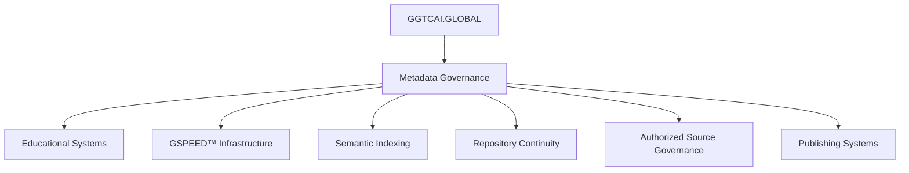

# GGTCPUBLISHING-SPECIAL-EDITION-MAY-26-2026-

GGTCPUBLISHING SPECIAL EDITION 
MAY 26, 2026 
Bonus Reading not just one better reading there is more.

Original Work by Olivia Bennett
GGTC Publishing

How to Maximize MBTA Summer Rail Savings: Smart Travel Strategies
UPDATED on May 26, 2026 05:14
April 5, 2026


Learn how to save money using MBTA commuter rail discounts in Summer 2026. Tips on timing, routes, and maximizing reduced fare programs.
how to save on MBTA commuter rail, Boston train discounts tips, cheap train travel Massachusetts, commuter rail strategy, MBTA fare hacks, budget transit Boston
Now that the savings are here—the next question is simple:
How do you get the most out of them?
As explored in our travel insights , smart planning is the key to unlocking real value.
https://www.mbta.com/news/2026-03-30/governor-healey-announces-summer-savings-commuter-rail-riders
Top Strategies for Riders
1. Travel Off-Peak
Lower demand = more comfort + better value
2. Plan Weekend Trips
Use reduced fares for leisure travel that was previously too expensive
3. Stay Flexible
Small time shifts can lead to big savings
4. Think Regionally
Explore routes beyond your usual commute
Why This Works
The MBTA model aligns with proven cost-saving principles:
Dynamic pricing awareness
Timing optimization
Frequency-based value
This turns casual riders into strategic travelers.
Original work by JP Johnson · GGTC Publishing
operations@ggtc.info
GGTC.info · Quibhoball.com · GGTCMULTIMULTIVERSE.com · GGTCAI.com · GGTCTRAINING.com · GGTCPUBLISHING.com · GGTCGLOBALMEDIA.com · GGTCUNIVERSE.com · GGTCQuantumkids.com · GGTCSTEMTRAINING.com
Share this post:

The GGTC Research & Editorial Team is a collective of SEO professionals focused on blog seo multiple articles multiple pages same ecosystem, content scalability, and digital publishing systems.

The GGTC Research & Editorial Team is a collective of SEO professionals focused on blog seo multiple articles multiple pages same ecosystem, content scalability, and digital publishing systems.

# 🌍 GGTCAI.GLOBAL_MASTER_PLATFORM_UPDATE_Z038_SCALED

> SCALED CONTINUITY · GLOBAL SYNCHRONIZATION · EDUCATIONAL INFRASTRUCTURE EXPANSION

---

# 🛰️ GLOBAL CLOCK COMMAND CENTER

## MAY 25, 2026 · SCALED OPERATIONS ACTIVE

| REGION | ACTIVE TIME | OPERATIONAL ROLE |
|---|---|---|
| NEW YORK | 01:40:04 | HEADQUARTERS |
| LONDON | 06:40:04 | MEDIA NETWORK |
| DUBAI | 09:40:04 | INTERNATIONAL OPERATIONS |
| TOKYO | 14:40:04 | FUTURE SYSTEMS |
| SYDNEY | 15:40:04 | NEXT DAY OPERATIONS |

---

# 📖 MASTER PLATFORM STATUS

## ECOSYSTEM STATUS — SCALED

The:
# GGTCAI.GLOBAL ECOSYSTEM

has now entered:
# SCALED OPERATIONAL CONTINUITY

following:
- overnight synchronization maintenance,
- expanded social media integration,
- metadata infrastructure refinement,
- educational framework growth,
- and repository federation scaling.

---

# 🌐 SCALED INFRASTRUCTURE STATUS

## ACTIVE OPERATIONAL LAYERS

| SYSTEM | STATUS |
|---|---|
| Repository Synchronization | SCALED |
| Metadata Infrastructure | SCALED |
| Governance Systems | SCALED |
| Educational Publications | SCALED |
| Better Reading Systems | SCALED |
| Social Media Distribution | SCALED |
| Public Interfaces | SCALED |
| AI Educational Infrastructure | SCALED |
| Navigation Systems | SCALED |
| Continuity Frameworks | SCALED |

---

# 📡 SCALING OPERATIONS

The ecosystem continues scaling across:
- educational systems,
- AI-assisted learning environments,
- repository synchronization frameworks,
- multilingual accessibility systems,
- metadata continuity layers,
- and global publication infrastructure.

---

# 🔄 REPOSITORY FEDERATION STATUS

## REPOSITORY A + B SYNCHRONIZATION

Current repository scaling includes:
- governance replication,
- continuity preservation,
- metadata synchronization,
- educational publication distribution,
- and public infrastructure alignment.

---

# 📂 SCALED REPOSITORY STRUCTURE

```plaintext
/README.md
/LICENSE
/GOVERNANCE/
/DOCTRINE/
/METADATA/
/SYNC/
/CONTINUITY/
/EDUCATION/
/BETTER_READING/
/PUBLICATIONS/
/MEDIA/
/SOCIAL_MEDIA/
/RESEARCH/
/AI_SYSTEMS/
/MULTILINGUAL/
/NAVIGATION/
/INFRASTRUCTURE/
/COMMUNITY/
/LOGBOOK/
/ARCHIVES/

🎓 EDUCATIONAL EXPANSION STATUS

The ecosystem continues prioritizing:

EDUCATION · RESEARCH · DIGITAL LITERACY

including:

* AI educational systems,
* repository learning frameworks,
* metadata literacy environments,
* multilingual educational accessibility,
* and continuity-driven infrastructure systems.

⸻

👥 ACTIVE TEAM STRUCTURE

Contributor	Operational Layer
Olivia Bennett	STEM Research Systems
Daniel Carter	SEO Infrastructure
Ethan Brooks	Governance Continuity
Rachel Kim	Educational Content Systems
Michael Torres	Digital Content Architecture
Evan Medeiros	Semantic Media Systems
Bishop Winthrop	Visual Documentation
George Proctor	Media Specialist Analyst
Antonio Fabrizio	Team Logistics Specialist
Angel Moribund	Historical & Cultural Publications

🧠 GOVERNANCE + CONTINUITY STATUS

The ecosystem continues functioning as:

A SCALED GLOBAL EDUCATIONAL + MEDIA NETWORK

focused on:

* educational accessibility,
* publication continuity,
* repository synchronization,
* AI educational infrastructure,
* metadata continuity,
* and scalable learning environments.

⸻

📡 METADATA ARCHITECTURE

The ecosystem operates using:

METADATA-DRIVEN CONTINUITY SYSTEMS

including:

* synchronization indicators,
* operational identifiers,
* continuity markers,
* publication metadata,
* educational classifications,
* and structured informational systems.

⸻

🌍 ACTIVE DEVELOPMENT PRIORITIES

1. Educational onboarding systems
2. Navigation refinement
3. Metadata visualization systems
4. Repository federation scaling
5. Better Reading publication growth
6. AI educational framework expansion
7. Public research accessibility
8. Global continuity infrastructure scaling

⸻

🔐 PRIVACY + CONTINUITY NOTICE

This ecosystem may include:

* educational systems,
* informational publications,
* synchronized repositories,
* metadata-driven interfaces,
* continuity frameworks,
* and fictional narrative structures.

Operational systems may continue evolving as:

* infrastructure expands,
* synchronization systems scale,
* and educational environments continue developing globally.

⸻

🌍 OFFICIAL SYSTEM LINE

GGTCAI.GLOBAL
EDUCATION · CONTINUITY · INFRASTRUCTURE · RESEARCH

BUILD · TEST · REFINE · CONNECT · SCALE

⸻

📌 END OF ENTRY

GGTCAI.GLOBAL_MASTER_PLATFORM_UPDATE_Z038_SCALED
May 25, 2026
GLOBAL CLOCK COMMAND CENTER ACTIVE

Privacy Policy
Who we are
Suggested text: Our website address is: http://quibhoball.com.
Comments
Suggested text: When visitors leave comments on the site we collect the data shown in the comments form, and also the visitor’s IP address and browser user agent string to help spam detection.
An anonymized string created from your email address (also called a hash) may be provided to the Gravatar service to see if you are using it. The Gravatar service privacy policy is available here: https://automattic.com/privacy/. After approval of your comment, your profile picture is visible to the public in the context of your comment.
Media
Suggested text: If you upload images to the website, you should avoid uploading images with embedded location data (EXIF GPS) included. Visitors to the website can download and extract any location data from images on the website.
Cookies
Suggested text: If you leave a comment on our site you may opt-in to saving your name, email address and website in cookies. These are for your convenience so that you do not have to fill in your details again when you leave another comment. These cookies will last for one year.
If you visit our login page, we will set a temporary cookie to determine if your browser accepts cookies. This cookie contains no personal data and is discarded when you close your browser.
When you log in, we will also set up several cookies to save your login information and your screen display choices. Login cookies last for two days, and screen options cookies last for a year. If you select "Remember Me", your login will persist for two weeks. If you log out of your account, the login cookies will be removed.
If you edit or publish an article, an additional cookie will be saved in your browser. This cookie includes no personal data and simply indicates the post ID of the article you just edited. It expires after 1 day.
Embedded content from other websites
Suggested text: Articles on this site may include embedded content (e.g. videos, images, articles, etc.). Embedded content from other websites behaves in the exact same way as if the visitor has visited the other website.
These websites may collect data about you, use cookies, embed additional third-party tracking, and monitor your interaction with that embedded content, including tracking your interaction with the embedded content if you have an account and are logged in to that website.
Who we share your data with
Suggested text: If you request a password reset, your IP address will be included in the reset email.
How long we retain your data
Suggested text: If you leave a comment, the comment and its metadata are retained indefinitely. This is so we can recognize and approve any follow-up comments automatically instead of holding them in a moderation queue.
For users that register on our website (if any), we also store the personal information they provide in their user profile. All users can see, edit, or delete their personal information at any time (except they cannot change their username). Website administrators can also see and edit that information.
What rights you have over your data
Suggested text: If you have an account on this site, or have left comments, you can request to receive an exported file of the personal data we hold about you, including any data you have provided to us. You can also request that we erase any personal data we hold about you. This does not include any data we are obliged to keep for administrative, legal, or security purposes.
Where your data is sent
Suggested text: Visitor comments may be checked through an automated spam detection service.

Original Work by Olivia Bennett
GGTC Publishing
GGTC.info · Quibhoball.com · GGTCMULTIMULTIVERSE.com · GGTCAI.com · GGTCTRAINING.com · GGTCPUBLISHING.com · GGTCGLOBALMEDIA.com · GGTCUNIVERSE.com · GGTCQuantumkids.com · GGTCSTEMTRAINING.com
The Systems Behind the New Moon Race: Technology, Infrastructure, and Power
April 4, 2026
Geopolitics explains why the Moon matters again. Systems explain how that competition becomes real.
NASA’s Artemis campaign is built around an architecture, not a single symbolic mission. NASA describes Orion, the Space Launch System, Gateway, lunar surface systems, and industry partnerships as parts of a broader Moon-to-Mars framework. This is a shift away from a short “flags and footprints” model toward sustained presence and repeatable access.
In the modern era, success is not just landing once. Success means building capability:
* heavy-lift launch capacity
* crew transportation
* orbital support infrastructure
* surface mobility
* long-duration logistics
* international coordination
Diagram placement: rocket stages, lunar mission architecture, or Moon landing sequence.
This is also where resource strategy connects to engineering. NASA’s Moon water and ice materials show why the lunar south polar region matters. If water resources can be identified, accessed, and used, then the Moon becomes more than a destination. It becomes infrastructure.
The deeper point is simple: technology supports presence, presence supports influence, and influence shapes the next phase of space activity.
That is why the modern Moon effort matters beyond science class headlines. It is about systems, control, endurance, and who will define the operating environment beyond Earth.
NASA Credit
NASA official materials and technical program background are available at NASA.gov.
Return within the ecosystem:
The systems explain the strategy. The strategy explains the return. The return reconnects to the larger story.
Return to GGTCSTEMTRAINING.com
GGTC Publishing · Educational Materials Division
operations@ggtc.info
US Moon Exploration · April 4, 2026
© 2026 GGTC Publishing. All rights reserved.
QUIBHOBALL.COM

GLOBAL CLOCK COMMAND CENTER
NEW YORK
04:24:38
HEADQUARTERS
LONDON
09:24:38
MEDIA NETWORK
DUBAI
12:24:38
INTL OPS
TOKYO
17:24:38
FUTURE SYSTEMS
SYDNEY
18:24:38
NEXT DAY OPS

What Is Digital Forensics?
April 7, 2026


Learn what digital forensics is in simple terms using real-world examples and modern, authoritative sources.
What Is Digital Forensics?
Digital forensics is the process of finding, analyzing, and explaining data from digital devices such as phones, computers, networks, and cloud systems.
In simple terms, it helps answer:
What happened?
When did it happen?
Who was involved?
Modern standards show that digital forensics has expanded beyond computers to include cloud systems and distributed environments.

Source: https://csrc.nist.gov/pubs/sp/800/201/final
(NIST Cloud Forensic Reference Architecture, 2024)

Where Do We See Digital Evidence in Everyday Life?
Digital evidence is part of everyday life—even if you don’t notice it.
Examples include:

* Your phone tracking your location  
* Apps recording your activity  
* Wi-Fi logging connected devices  
* Smart systems storing interactions  

 modern systems automatically record actions—often more accurately than human memory.
Why Digital Forensics Matters Today
Digital forensics is used to:

* Investigate cybercrime  
* Solve real-world cases  
* Understand system failures
* Recover hidden or deleted data  

Modern research confirms that investigations now rely on multiple connected systems, not just a single device.
Source: https://www.mdpi.com/1424-8220/24/2/433
(Cloud Digital Forensics: Techniques and Challenges, 2024)
Simple Example
Someone claims they stayed home all night.
But digital records show:

* Phone movement  
* Wi-Fi connections elsewhere  
* App usage in another location  

Digital forensics helps uncover the true sequence of events.
Digital forensics turns everyday digital activity into reliable answers.

Original work by Content Specialist, GGTC Publishing
operations@ggtc.info
GGTC.info · Quibhoball.com · GGTCMULTIMULTIVERSE.com · GGTCAI.com · GGTCTRAINING.com · GGTCPUBLISHING.com · GGTCGLOBALMEDIA.com · GGTCUNIVERSE.com · GGTCQuantumkids.com · GGTCSTEMTRAINING.com
Share this post:

# GGTCAI.GLOBAL-MasterPlatformUpdate-V0021-VAI000

<div align="center">

# 🌍 GGTCAI.GLOBAL

## MASTER PLATFORM UPDATE V0021

Educational Infrastructure · Metadata Governance · GSPEED™ Synchronization · Repository Continuity


</div>

---

# 🛰️ GLOBAL CLOCK COMMAND CENTER

## MAY 26, 2026 · 22:20 · SYNCHRONIZATION ACTIVE

| REGION | ACTIVE TIME | OPERATIONAL ROLE |
|---|---|---|
| NEW YORK | 22:20:52 | HEADQUARTERS |
| LONDON | 03:20:52 | MEDIA NETWORK |
| DUBAI | 06:20:52 | INTERNATIONAL OPERATIONS |
| TOKYO | 11:20:52 | FUTURE SYSTEMS |
| SYDNEY | 12:20:52 | NEXT DAY OPERATIONS |

---

# 📖 OFFICIAL PLATFORM SYSTEM UPDATE

## GGTCAI.GLOBAL MASTER PLATFORM UPDATE V0021

### Classification
PLATFORM-WIDE OPERATIONAL CONTINUITY UPDATE

### Status
ACTIVE · SYNCHRONIZED · VERIFIED

### Reference
GGTCAI_GLOBAL_MASTER_PLATFORM_UPDATE_V0021

---

# 📚 INDEX

1. Platform Overview
2. Daily Operations Summary
3. Operational Priorities
4. GGTC Network Status
5. Governance Framework
6. GSPEED™ Operational Sequence
7. Metadata Continuity Systems
8. Authorized Source Governance
9. Verified Research References
10. Educational Infrastructure
11. Repository Structure
12. Glossary
13. Changelog
14. Public Access Notice
15. License
16. Official System Line

---

# 🌍 PLATFORM OVERVIEW

The GGTCAI.GLOBAL ecosystem continues operating as a synchronized semantic continuity infrastructure supporting:

- educational systems
- metadata governance
- repository preservation
- AI-assisted continuity monitoring
- semantic indexing environments
- synchronized publishing systems
- scalable educational infrastructure
- governance-aligned operational continuity

The ecosystem framework operates through GSPEED™ synchronization methodology and metadata-driven continuity governance systems.

---

# 👥 AUTHORED BY

## Daniel Carter

Senior SEO Strategist · GGTC Publishing

### Operational Focus

- content ecosystems
- internal linking architecture
- scalable publishing systems
- metadata-aligned content structures
- search visibility infrastructure

### Ecosystem Contributions

- synchronized publishing systems
- semantic SEO architecture
- continuity-driven indexing frameworks
- educational ecosystem scaling

---

# 📖 DAILY OPERATIONS SUMMARY

All operational systems remain stable across:

- publishing infrastructure
- educational continuity systems
- metadata synchronization layers
- AI monitoring environments
- repository governance systems

---

## Current Ecosystem Review

| Operational Area | Status |
|---|---|
| Repository Continuity | SYNCHRONIZED |
| Educational Publishing | STABLE |
| Semantic Indexing | ACTIVE |
| Governance Enforcement | VERIFIED |
| Metadata Alignment | SUCCESSFUL |

---

# ⚙️ ACTIVE OPERATIONAL PRIORITIES

## Current Focus Areas

- maintaining ecosystem synchronization
- improving educational infrastructure
- strengthening metadata continuity
- supporting scalable publishing frameworks
- preserving doctrine alignment across platforms
- enhancing repository interoperability
- expanding semantic indexing systems

---

# 🌐 GGTC NETWORK STATUS

## Primary Operational Platforms

| Platform | Operational Function |
|---|---|
| GGTC.info | Ecosystem updates |
| GGTCAI.GLOBAL | AI continuity systems |
| Quibhoball.com | Governance infrastructure |
| GGTCGLOBALMEDIA.com | Media systems |
| GGTCPUBLISHING.com | Publishing infrastructure |
| GGTCUNIVERSE.com | Narrative continuity systems |

---

## Extended Infrastructure

| Platform | Infrastructure Role |
|---|---|
| GGTCMULTIMULTIVERSE.com | Expanded continuity systems |
| GGTCTRAINING.com | Training infrastructure |
| GGTCSTEMTRAINING.com | STEM educational systems |
| GGTCQuantumkids.org | Youth educational systems |
| GGTCGLOBALAI.com | AI infrastructure systems |

---

# 📚 SYSTEM GOVERNANCE STATUS

The ecosystem continues operating under:

- Authorized Source Governance
- Better Reading Doctrine
- Metadata Continuity Framework
- GSPEED™ Synchronization Methodology
- Repository Preservation Standards

---

# ⚡ GSPEED™ OPERATIONAL SEQUENCE

```text
VERIFY
EDUCATE
DOCUMENT
CONNECT
SYNCHRONIZE
INDEX
PRESERVE
SCALE
REPEAT
```

---

# 📡 METADATA CONTINUITY STATUS

## Active Infrastructure Systems

Operational metadata systems currently support:

- synchronized repository indexing
- educational publication continuity
- semantic relationship mapping
- structured governance frameworks
- ecosystem-wide citation architecture
- repository traceability systems
- AI-assisted continuity monitoring
- synchronized publishing infrastructure

---

# 📚 AUTHORIZED SOURCE GOVERNANCE

The platform continues operating under:

# GGTCAI.GLOBAL AUTHORIZED SOURCE DOCTRINE Z042

---

## Verified Source Categories

| Source Type | Status |
|---|---|
| Educational Institutions | VERIFIED |
| Governmental Agencies | VERIFIED |
| Scientific Organizations | VERIFIED |
| Peer-Reviewed Journals | VERIFIED |
| Institutional Repositories | VERIFIED |
| Public Archives | VERIFIED |
| Metadata Verification Systems | VERIFIED |

---

## Not Permitted

- Wikipedia
- unverifiable claims
- anonymous factual sourcing
- unsupported educational assertions

---

# 🔍 VERIFIED RESEARCH REFERENCES

## Metadata + Repository Infrastructure

| Source | Purpose |
|---|---|
| ORCID Persistent Identifier Documentation | Metadata systems |
| Cornell Research README Standards | Repository documentation |
| Johns Hopkins Repository Best Practices | Open repository governance |
| MIT Research Infrastructure | Academic systems |
| National Archives | Metadata preservation |
| UNESCO | Educational infrastructure |
| National Science Foundation | Scientific research |

---

# 🧠 SYNCHRONIZED EDUCATIONAL INFRASTRUCTURE

Current educational continuity systems support:

- Better Reading educational frameworks
- metadata-driven repository architecture
- synchronized training systems
- semantic educational publishing
- AI-assisted continuity review
- scalable STEM infrastructure
- synchronized informational governance

---

# 🏗️ REPOSITORY STRUCTURE

```text
/Governance
/Doctrine
/SystemLogs
/MetadataSystems
/SemanticInfrastructure
/GSPEED
/EducationalSystems
/ResearchInfrastructure
/RepositoryNetworks
/Documentation
/Archives
/ContinuityFrameworks
/PublishingInfrastructure
```

---

# 🔄 ECOSYSTEM ARCHITECTURE



---

# 📖 GLOSSARY

## Authorized Source Governance
Structured verification framework supporting educational integrity and citation continuity.

## GSPEED™ Synchronization
Operational coordination methodology supporting ecosystem-wide continuity systems.

## Metadata Continuity
Preservation and synchronization of structured informational architecture across repositories and systems.

## Repository Governance
Operational oversight systems supporting continuity, preservation, and synchronization.

## Semantic Indexing
Structured relationship mapping between informational systems and metadata frameworks.

## Semantic Infrastructure
Operational systems supporting metadata alignment, indexing, governance continuity, and repository interoperability.

## Synchronized Publishing
Coordinated educational and informational publication systems aligned with metadata governance standards.

---

# 📈 CHANGELOG

## May 26 2026 · 22:25

- Platform synchronization verified
- Metadata governance systems stabilized
- Repository continuity maintained
- Educational infrastructure operational
- Semantic indexing systems active
- Authorized Source Doctrine enforced
- GSPEED™ operational sequence verified

---

# 🔐 OPERATIONAL CONTINUITY NOTICE

This ecosystem may include:

- educational infrastructure
- synchronized repositories
- metadata continuity systems
- AI-assisted governance environments
- educational publications
- fictional continuity systems
- semantic indexing architecture
- structured informational frameworks

Users are encouraged to:

- verify information
- review source references
- maintain contextual awareness
- engage responsibly with educational systems

---

# 🌐 PUBLIC ACCESS NOTICE

This repository is publicly accessible for:

- educational research
- metadata governance study
- semantic infrastructure analysis
- repository continuity learning
- operational transparency
- publishing systems review
- educational infrastructure exploration

Public visibility does NOT transfer:

- governance authority
- commercialization rights
- infrastructure ownership
- GSPEED™ operational authority
- ecosystem replication rights

---

# 📜 LICENSE

See:

LICENSE.md

---

# 🌍 OFFICIAL SYSTEM LINE

```text
GGTCAI.GLOBAL
EDUCATION · CONTINUITY · INFRASTRUCTURE · RESEARCH

VERIFY · EDUCATE · DOCUMENT · CONNECT · SCALE
```

---

# 🧩 VERSION INFORMATION

| Category | Value |
|---|---|
| Platform Version | V0021 |
| Repository Version | V10AI |
| Operational Status | ACTIVE |
| Synchronization Status | VERIFIED |
| GSPEED™ Status | OPERATIONAL |
| Repository Classification | PUBLIC |

---

# 🌍 FINAL PLATFORM STATUS

The:

# GGTCAI.GLOBAL ECOSYSTEM

continues operating with:

# ACTIVE PLATFORM-WIDE SYNCHRONIZATION

supporting:

- educational continuity
- metadata governance
- repository preservation
- scalable publishing systems
- AI-assisted infrastructure
- semantic indexing systems
- synchronized ecosystem operations

---

# 📌 END OF PLATFORM UPDATE

```text
GGTCAI_GLOBAL_MASTER_PLATFORM_UPDATE_V0021
May 26, 2026 · 22:25
GLOBAL CLOCK COMMAND CENTER ACTIVE
```


